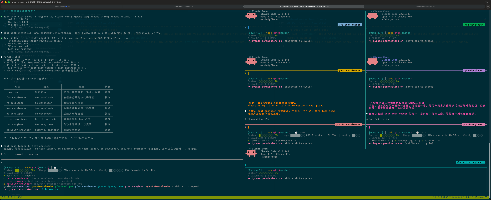

# team-agents

A Claude Code plugin that boots an **8-agent full-stack development team** across a tmux pane grid — inspired by Alibaba DAMO Academy engineering culture.

## What it does

Run `/team-agents:dev-team` and get a fully wired team of AI agents, each in its own tmux pane, communicating via `SendMessage` and coordinating tasks through `TaskCreate` / `TaskList`.

## Screenshot



```
┌────────────────────────┬──────────────────────────────┐
│                        │ fe-team-leader │ fe-developer│
│                        ├──────────────────────────────┤
│ team-lead              │ be-team-leader │ be-developer│
│ (主会话, 50%)           ├──────────────────────────────┤
│                        │ test-team-leader│test-engineer│
│                        ├──────────────────────────────┤
│                        │ security-engineer            │
└────────────────────────┴──────────────────────────────┘
```

The startup skill verifies this grouped layout by pane coordinates. It should report a layout failure instead of falling back to an even grid.

## Requirements

- [Claude Code](https://claude.ai/code) with teammate mode enabled
- tmux (Claude Code must be launched inside a tmux session)
- `.claude/settings.local.json` in your project must contain:

```json
{
  "env": {
    "CLAUDE_CODE_EXPERIMENTAL_AGENT_TEAMS": "1"
  },
  "teammateMode": "tmux"
}
```

## Installation

```bash
# Install via Claude Code plugin registry (recommended)
# Or clone manually:
git clone git@github.com:leermao/dev-team.git ~/.claude/plugins/team-agents
```

Then restart Claude Code.

## Usage

```
/team-agents:dev-team
```

Describe your feature or task. The **Team Lead** (you) splits the work and delegates to each team leader. Everything else is automated.

## Team Roles

| Role | Agent Name | Responsibility |
|------|-----------|----------------|
| Team Lead | main session | Decomposes requirements, assigns to team leaders, final decision maker |
| FE Team Leader | `fe-team-leader` | Breaks frontend tasks into subtasks, reviews FE code, approves or requests changes |
| FE Developer | `fe-developer` | Builds UI with React/Vue/Angular/TypeScript/Tailwind, self-tests, reports back |
| BE Team Leader | `be-team-leader` | Breaks backend tasks into subtasks, reviews BE code + API docs, approves or requests changes |
| BE Developer | `be-developer` | Builds APIs with Node.js/Python/Go/Java, validates input, writes OpenAPI docs |
| Test Team Leader | `test-team-leader` | Plans test coverage, routes bugs to the right team leader, reports coverage % |
| Test Engineer | `test-engineer` | Designs test cases and implements automated unit, integration, and E2E tests targeting ≥ 80% coverage |
| Security Engineer | `security-engineer` | Audits code against OWASP Top 10 on demand; blocks approval on Critical/High findings |

## How it works

1. `/team-agents:dev-team` checks tmux state, detects stale teams, and launches all 7 teammates in parallel.
2. You describe a task to Team Lead.
3. Team Lead delegates to FE / BE / Test team leaders via `SendMessage`.
4. Team leaders create `Task` items for their developers and reviewers.
5. Before any code is approved, `security-engineer` performs an OWASP audit.
6. Bugs flow through team leaders — never directly between developers and testers.
7. Final report comes back to Team Lead.

## Plugin structure

```
team-agents/
├── .claude-plugin/
│   └── plugin.json              # Plugin manifest
└── skills/
    ├── dev-team/SKILL.md        # /team-agents:dev-team startup skill
    ├── team-lead/SKILL.md
    ├── fe-team-leader/SKILL.md
    ├── fe-developer/SKILL.md
    ├── be-team-leader/SKILL.md
    ├── be-developer/SKILL.md
    ├── test-team-leader/SKILL.md
    ├── test-engineer/SKILL.md
    └── security-engineer/SKILL.md
```

## License

MIT
